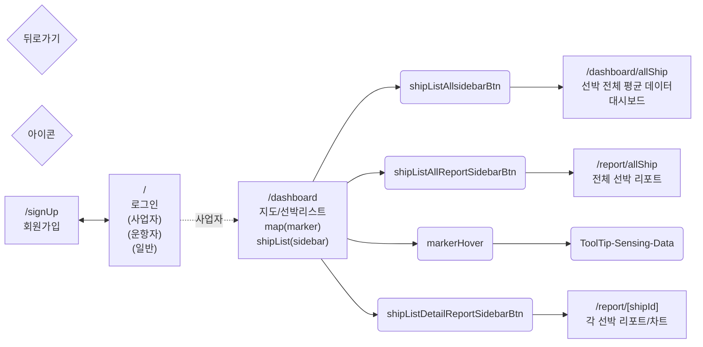

# IoT-Page-Flow

```mermaid
flowchart LR
   뒤로가기{뒤로가기}
   아이콘{아이콘}
   shipListAllBtn(shipListAllsidebarBtn)
   shipListAllReportBtn(shipListAllReportSidebarBtn)
   shipListDetailReportBtn(shipListDetailReportSidebarBtn)
   markerHover(markerHover)

   회원가입["`/signUp
   회원가입`"]

   통합로그인["`/
   로그인
   (사업자)
   (운항자)
   (일반)`"]

   사업자["`/dashboard
   지도/선박리스트
   map(marker)
   shipList(sidebar)
   `"]

   대시보드["`/dashboard/allShip
   선박 전체 평균 데이터
   대시보드`"]

   전체리포트["`/report/allShip
   전체 선박 리포트`"]

   각선박리포트차트["`/report/[shipId]
   각 선박 리포트/차트`"]

   회원가입 <--> 통합로그인
   통합로그인-. 사업자 .-> 사업자
   사업자 --> shipListAllBtn --> 대시보드
   사업자 --> shipListAllReportBtn --> 전체리포트
   사업자--> markerHover --> 툴팁(ToolTip-Sensing-Data)
   사업자--> shipListDetailReportBtn --> 각선박리포트차트
```
