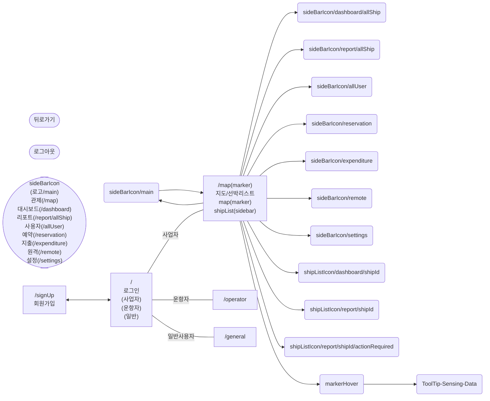

# IoT-Page-Flow

```mermaid
flowchart LR
   뒤로가기([뒤로가기])
   로그아웃([로그아웃])

   아이콘(["sideBarIcon
   (로고/main)
   관제(/map)
   대시보드(/dashboard)
   리포트(/report/allShip)
   사용자(/allUser)
   예약(/reservation)
   지출(/expenditure)
   원격(/remote)
   설정(/settings)"])


   sideBarIcon/main(sideBarIcon/main)
   sideBarIcon/dashboard/allShip(sideBarIcon/dashboard/allShip)
   sideBarIcon/report/allShip(sideBarIcon/report/allShip)
   sideBarIcon/allUser(sideBarIcon/allUser)
   sideBarIcon/reservation(sideBarIcon/reservation)
   sideBarIcon/expenditure(sideBarIcon/expenditure)
   sideBarIcon/expenditure(sideBarIcon/expenditure)
   sideBarIcon/remote(sideBarIcon/remote)
   sideBarIcon/settings(sideBarIcon/settings)

   shipListIcon/dashboard/shipId(shipListIcon/dashboard/shipId)
   shipListIcon/report/shipId(shipListIcon/report/shipId)
   shipListIcon/report/shipId/actionRequired(shipListIcon/report/shipId/actionRequired)

   markerHover(markerHover)

   회원가입["`/signUp
   회원가입`"]

   통합로그인["`/
   로그인
   (사업자)
   (운항자)
   (일반)`"]

   사업자["`/map(marker)
   지도/선박리스트
   map(marker)
   shipList(sidebar)
   `"]

   운항자["`/operator
   `"]

   일반사용자["`/general
   `"]

   회원가입 <--> 통합로그인

   통합로그인-- 사업자 --- 사업자
   통합로그인-- 운항자 --- 운항자
   통합로그인-- 일반사용자 --- 일반사용자

   sideBarIcon/main --> 사업자
   사업자 --> sideBarIcon/main

   사업자 --> sideBarIcon/dashboard/allShip
   사업자 --> sideBarIcon/report/allShip
   사업자 --> sideBarIcon/allUser
   사업자 --> sideBarIcon/reservation
   사업자 --> sideBarIcon/expenditure
   사업자 --> sideBarIcon/remote
   사업자 --> sideBarIcon/settings

   사업자 --> shipListIcon/dashboard/shipId
   사업자--> shipListIcon/report/shipId
   사업자--> shipListIcon/report/shipId/actionRequired

   사업자--> markerHover --> 툴팁(ToolTip-Sensing-Data)
```
